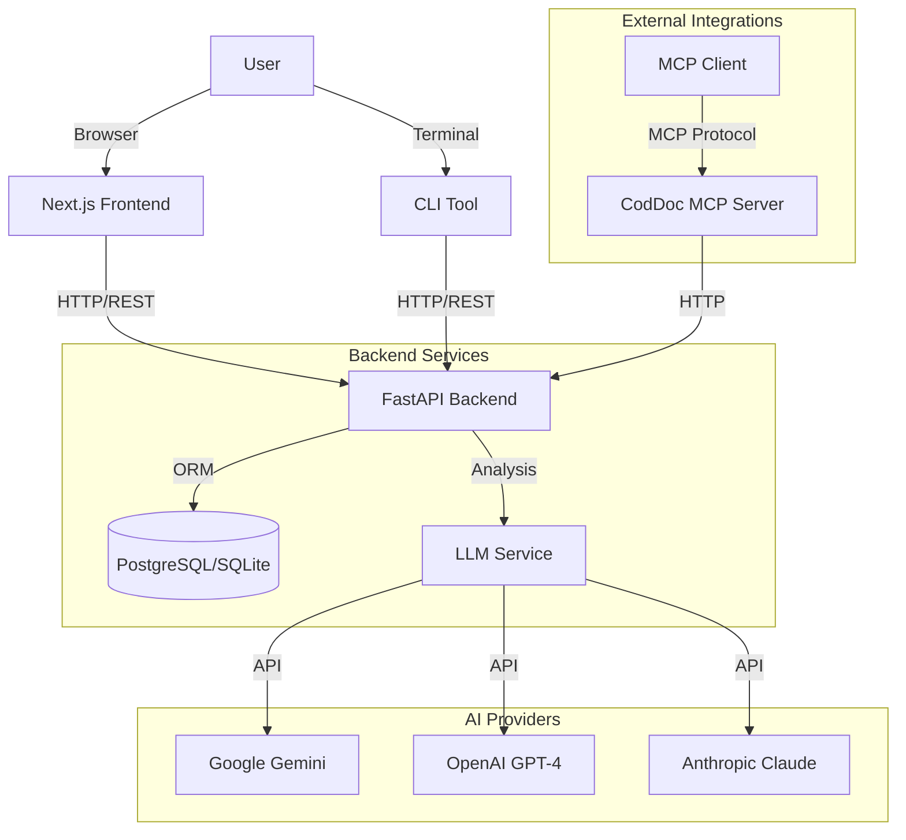

# CodDoc AI System Architecture

## High-Level Overview

CodDoc AI follows a modern microservices-ready architecture with clear separation of concerns between the frontend, backend, and AI services.

## Component Details

### 1. Frontend (Next.js)
- **Framework**: Next.js 14 (App Router)
- **Styling**: Tailwind CSS with custom design system
- **State Management**: React Query for server state
- **Visualization**: React Syntax Highlighter, rich Markdown rendering

### 2. Backend (FastAPI)
- **Framework**: FastAPI (High performance async framework)
- **Database**: SQLAlchemy ORM with Pydantic for validation
- **Migrations**: Alembic for schema management
- **Testing**: Pytest with high coverage

### 3. LLM Service
- **Pattern**: Strategy Pattern (Abstract Base Class)
- **Providers**: 
  - `GeminiProvider`: Default, cost-effective
  - `OpenAIProvider`: High capability fallback
  - `AnthropicProvider`: Alternative high capability
- **Abstraction**: Unified interface for `analyze_code` and `generate_documentation`

### 4. Database Schema
- **CodeReviews**: Stores code snippets, analysis results, and metadata
- **Documentation**: Stores generated docs and source code mapping
- **Reviews**: History tracking and retrieval

### 5. Deployment
- **Containerization**: Multi-stage Docker builds for small image sizes
- **Orchestration**: Docker Compose for local/VPS deployment
- **Cloud**: Railway (Backend/DB) + Vercel (Frontend) architecture
